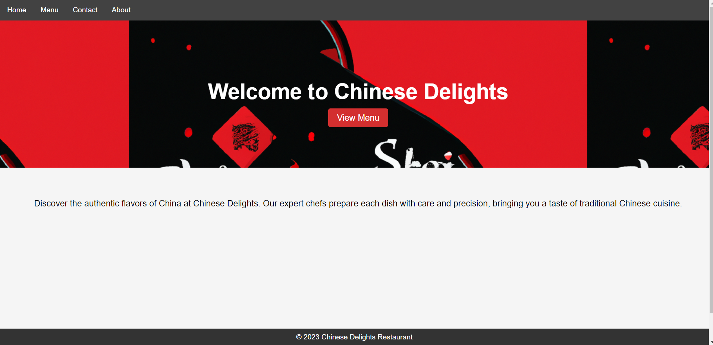
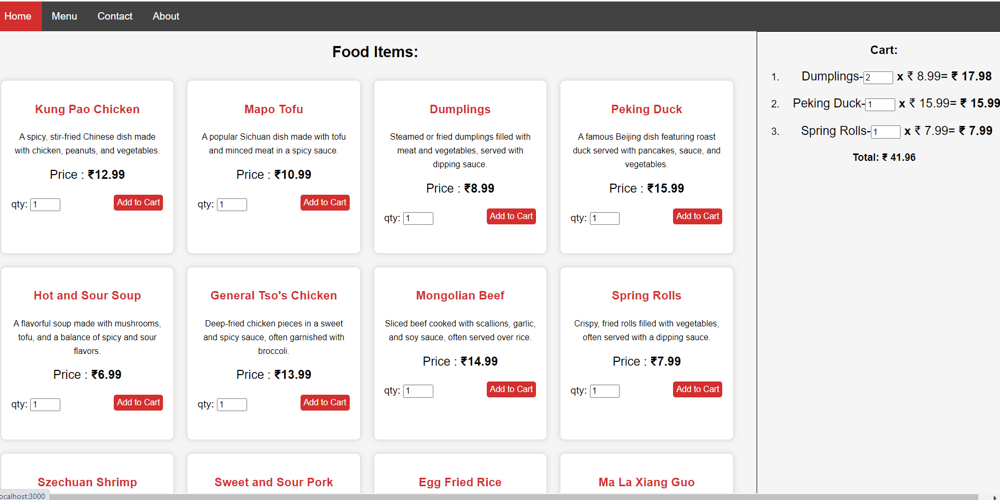

# Restaurant App 1.0!

 
Hi! this is my first **Restaurant App** with limited Features and Pages. This is a full stack app that pulls data from db and projects into client and main feautre of the app is **cart functionality**.

## Stack used :

 1. React 
 2. React Router for routing pages
 3. Express Framework
 4. MongoDB

### Landing Page :

### Menu Items & Cart:

 -  Add food Items to Cart
 - Adjust Quantity - Add 1 or mode food items from Menu/ change quantity from cart
 - view Total Cost

 

